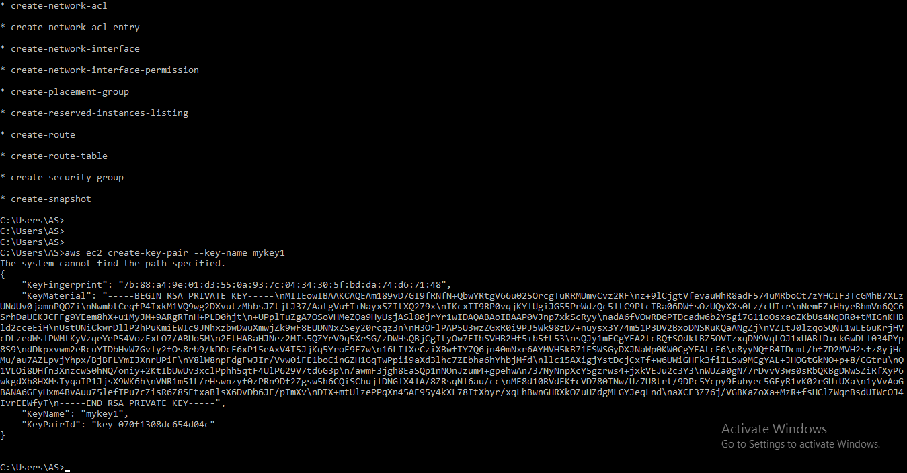

#Successfully Completed one more Task Given by Mr. Vimal Daga Sir in the AWS- CSA & Developer Training.

Connecting AWS account with CLI: Creation of new instance, Keypair, security-group(firewall rule) and attaching EBS volume

- AWS Account Configuration Command : aws Configure ,  For connecting the AWS to the AWS CLI we need to first install the aws cli: For Windows: (https://awscli.amazonaws.com/AWSCLIV2.msi) , for Configuration we need Access Key and Security Key So we create the IAM Account in AWS Console. After successfully creation of IAM user it will show you the Access key ID and Security Access ID which is required to attach the aws cli with aws account. Download the csv file.

1 Create a key pair 

2 Create a security group 

3 Launch an instance using the above created key pair and security group.

4 Create an EBS volume of 1 GB.

5 The final step is to attach the above created EBS volume to the instance you created in the previous steps.

- Command For Key Pair Genration : aws create-key-pairs --key-name mykey1 

- Security Group Command : aws ec2 create-security-group --group-name mygroupsecurity --description "security group" 
- Add the Authorization in Security Group : aws ec2 authorize-security-group-ingress --group-id sg-0768517209a4f9d55 --protocol ssh --port 22 --cidr 152.57.28.72/32

- Description Of Security Group : aws ec2 describe-security-groups --group-names mygroupsecurity

- Instance Launch Command : aws ec2 run-instances --image-id    ami-0e306788ff2473ccb --instance-type    t2.micro --count 1 --subnet-id subnet-b6f08ffa --security-group-ids sg-0768517209a4f9d55 --key-name mykey1

- Description Of Instance : aws ec2 describe-instances --instance-ids i-0d24f9a3d4cb5a525

- Create Volume Command : aws ec2 create-volume --size 1 --encrypted  --availability-zone  ap-south-1b  

- Attach Created Volume : aws ec2 attach-volume --device /dev/sdh --instance-id i-0d24f9a3d4cb5a525 --volume-id vol-012e2b70c026dae5e

Thank you Sir..!!!

